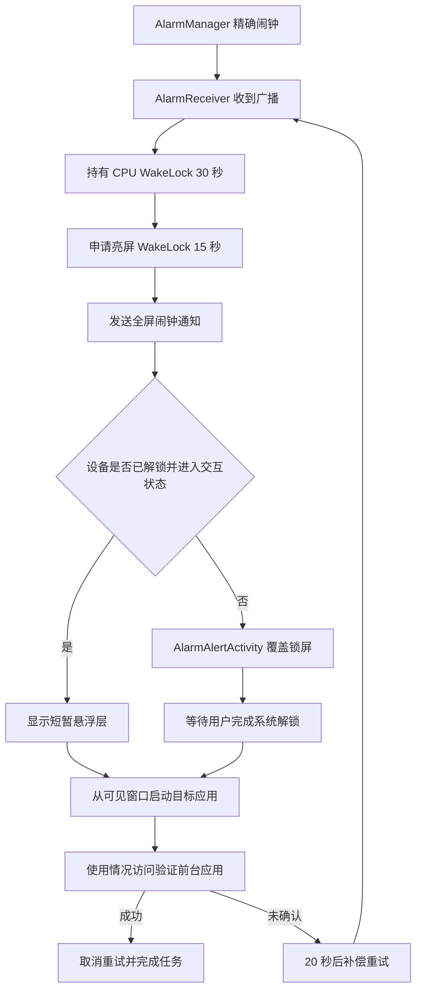

# AutoOpenApp

AutoOpenApp 是一个 Android 定时拉起工具，用于在指定时间自动打开目标应用或页面。当前默认目标为飞书，并针对灭屏、锁屏、后台启动限制和国产系统进程保活做了兼容处理。

当前版本：`2.8.0 (versionCode 19)`

- 最低 Android 版本：Android 8.0（API 26）
- 目标 Android 版本：Android 16（API 36）
- 默认目标包名：`com.ss.android.lark`
- 默认目标 Activity：`.main.app.MainActivity`

## 主要能力

- 支持每天固定随机早间时间，并在早间成功后生成当天晚间指定日期任务。
- 支持仅工作日执行。
- 使用系统精确闹钟触发任务。
- 灭屏时主动申请短时亮屏。
- 使用全屏闹钟通知处理锁屏场景。
- 使用短暂悬浮层绕过部分厂商的后台 Activity 启动限制。
- 通过“使用情况访问”确认目标应用是否真正进入前台。
- 拉起未确认时每 20 秒补偿重试，最多执行 6 次拉起尝试。
- 成功后自动删除一次性任务；早间成功后生成当天晚间任务，晚间完成后生成下一次早间随机时间。
- 目标应用打开成功后 15 秒自动回到桌面，减少重复停留在打卡页。
- 使用前台服务、巡检任务和独立守护进程维护排程。

## 灭屏拉起流程



### 1. 精确闹钟

排程入口位于 [`AlarmScheduler`](app/src/main/java/com/autoopenapp/AlarmScheduler.java)：

- 优先使用 `AlarmManager.setAlarmClock()`。
- 精确调度发生异常时使用 `setAndAllowWhileIdle()` 容错。
- 主任务和补偿重试使用独立、稳定的 `PendingIntent` URI 身份，避免 requestCode 碰撞或不同任务互相覆盖。
- Android 12 及以上会先检查精确闹钟授权状态。

项目只声明：

```xml
<uses-permission android:name="android.permission.SCHEDULE_EXACT_ALARM" />
```

不声明 `USE_EXACT_ALARM`。

### 2. 闹钟广播直接亮屏

[`AlarmReceiver`](app/src/main/java/com/autoopenapp/AlarmReceiver.java) 收到合法任务后：

1. 持有 30 秒 `PARTIAL_WAKE_LOCK`，避免 CPU 在处理过程中再次休眠。
2. 使用 `SCREEN_BRIGHT_WAKE_LOCK | ACQUIRE_CAUSES_WAKEUP` 点亮屏幕 15 秒。
3. 启动前台保活服务并进入统一拉起流程。
4. 未确认成功时安排下一次补偿重试。

所有 WakeLock 都带超时，并在处理完成或页面暂停时主动释放。

### 3. 全屏提醒路径

[`TargetLauncher`](app/src/main/java/com/autoopenapp/TargetLauncher.java) 会先发送高重要性闹钟通知：

- 通知渠道重要性为 `IMPORTANCE_HIGH`。
- 通知类别为 `CATEGORY_ALARM`。
- 使用 `setFullScreenIntent()` 指向 `AlarmAlertActivity`。
- 锁屏通知内容设为公开可见。

[`AlarmAlertActivity`](app/src/main/java/com/autoopenapp/AlarmAlertActivity.java) 使用：

- `setShowWhenLocked(true)`
- `setTurnScreenOn(true)`
- `FLAG_SHOW_WHEN_LOCKED`
- `FLAG_TURN_SCREEN_ON`
- `FLAG_KEEP_SCREEN_ON`

如果存在 PIN、密码、图案或指纹等安全锁屏，页面只会请求系统解锁，并在系统确认解锁成功后启动目标应用，不会绕过设备凭据。

### 4. 悬浮层兜底路径

部分厂商系统会拦截后台直接执行 `startActivity()`。当屏幕已经被唤醒且设备未被安全锁定时，[`OverlayLaunchService`](app/src/main/java/com/autoopenapp/OverlayLaunchService.java) 会：

1. 启动短时前台服务。
2. 添加一个 `TYPE_APPLICATION_OVERLAY` 顶部可见窗口。
3. 等待 80 毫秒，使窗口完成附着。
4. 从可见窗口调用 `TargetLauncher.launch()`。
5. 最迟 3 秒后移除窗口并停止服务。

可见悬浮窗口能让部分厂商系统把本次启动识别为“可见应用发起”，降低后台 Activity 启动被直接拦截的概率。

### 5. 结果验证与任务收尾

启动请求被系统接受不等于目标应用真的进入前台。项目通过 [`ForegroundAppVerifier`](app/src/main/java/com/autoopenapp/ForegroundAppVerifier.java) 和 [`LaunchTracker`](app/src/main/java/com/autoopenapp/LaunchTracker.java) 记录启动时间并检查前台包名。

确认成功后统一执行：

- 标记本次任务成功。
- 取消该任务的补偿重试。
- 删除已完成的指定日期任务。
- 如果命中固定随机早间时间，则按当天星期生成一个晚间指定日期任务。
- 如果命中晚间指定日期任务，则删除该任务并生成下一次早间随机时间。
- 重新安排剩余任务。
- 目标应用确认打开成功后，延迟 15 秒回到系统桌面。

## 固定随机打卡规则

固定随机任务按“早间每日任务 + 当天晚间指定日期任务”运行：

- 早间时间在 `08:30-08:50` 之间随机。
- 所有早间任务不得早于 `08:20`。
- 周一、周二、周四：晚间任务在 `21:30-22:00` 之间随机。
- 周三、周五：晚间任务在 `max(18:00, 早间计划时间 + 9 小时 30 分)` 到 `21:29` 之间随机，明确不能到 `21:30` 后。
- 早间任务成功后生成当天晚间指定日期任务；如果升级前已有旧的每日晚间固定任务，会被迁移移除。
- 晚间任务成功后删除当天晚间指定日期任务，并生成下一次早间随机时间。

## 所需权限

| 权限或系统能力 | 用途 |
| --- | --- |
| 精确闹钟 | 保证任务尽可能准时触发 |
| 通知 | 显示前台服务和闹钟提醒 |
| 全屏通知 | 锁屏或灭屏时打开提醒页 |
| 悬浮窗 | 创建可见窗口后拉起目标应用 |
| WakeLock | 保持 CPU 运行并短时点亮屏幕 |
| 使用情况访问 | 确认目标应用是否真正进入前台 |
| 电池优化白名单 | 降低后台服务和闹钟被限制的概率 |
| 后台自启动 | 设备重启或进程退出后恢复排程 |

## 小米 / MIUI 设置

小米系统除了 Android 标准权限外，还需要确认以下厂商权限。不同 MIUI/HyperOS 版本的名称可能略有差异：

1. 应用信息 → 其他权限：允许“锁屏显示”。
2. 应用信息 → 其他权限：允许“后台弹出界面”或“后台打开新窗口”。
3. 允许悬浮窗。
4. 开启后台自启动。
5. 省电策略设置为“无限制”。
6. 允许通知、锁屏通知和悬浮通知。
7. 保持“定时打开提醒”通知渠道为高重要性。
8. 开启使用情况访问。

在 MIUI 12 的 AppOps 中，两个关键厂商权限分别对应：

- `10020`：锁屏显示。
- `10021`：后台弹出界面。

这两项必须为 `allow`。应用本身不能静默授予厂商权限，应由用户在系统设置中确认。

## 构建与测试

运行单元测试并生成 Debug APK：

```bash
./gradlew :app:testDebugUnitTest :app:assembleDebug
```

APK 输出位置：

```text
app/build/outputs/apk/debug/app-debug.apk
```

安装到已连接设备：

```bash
adb install -r -t --no-incremental app/build/outputs/apk/debug/app-debug.apk
```

小米设备可能要求在手机端开启“USB 安装”并确认安装弹窗。如果 USB 安装被厂商策略阻止，也可以把 APK 放入手机 Download 目录，再通过系统文件管理器打开安装。

## 灭屏验证方法

1. 首次打开应用并完成所需授权。
2. 设置 2～3 分钟后的指定日期任务。
3. 确认精确闹钟已登记：

```bash
adb shell dumpsys alarm | rg 'com.autoopenapp|MAIN_ALARM'
```

4. 按电源键灭屏，不要执行 `am force-stop`。强制停止应用会使闹钟和接收器失效，测试结果无效。
5. 确认设备确实休眠：

```bash
adb shell dumpsys power | rg 'mWakefulness=|Display Power:'
```

预期应包含：

```text
mWakefulness=Asleep
Display Power: state=OFF
```

6. 到点后查看日志：

```bash
adb logcat -v threadtime \
  -s AutoOpenApp ActivityTaskManager NotificationService AlarmManager
```

关键日志顺序通常为：

```text
AlarmReceiver 收到闹钟广播
闹钟广播已直接申请亮屏 15 秒
已发送全屏提醒通知
悬浮层已显示，作为可见窗口拉起目标
目标启动请求已被系统接受
前台验证 target=... observed=... matched=true
```

## 真机验证记录

2026-08-14 在小米 MI 8 SE、Android 10、MIUI 12.5.1 国行版验证：

- `11:43:24`：设备为 `Asleep`，显示屏为 `OFF`。
- `11:44:00`：精确闹钟准时触发并申请亮屏。
- MIUI 通知助手拦截了全屏通知展示。
- 悬浮层兜底路径成功启动飞书。
- `11:44:20`：前台校验确认 `com.ss.android.lark`，`matched=true`。
- 一次性任务被正确删除，补偿重试被取消。

这次验证说明：即使厂商通知策略阻止全屏提醒，只要设备没有安全锁定、悬浮窗和后台弹出权限有效，悬浮层兜底仍能完成灭屏拉起。

## 已知边界

- 应用不能绕过 PIN、密码、图案、指纹等安全凭据。
- 厂商系统升级后可能新增后台启动或通知限制，需要重新检查权限。
- 用户强制停止应用后，Android 会阻止其接收闹钟和系统广播，必须重新手动打开应用。
- 精确闹钟、全屏通知、悬浮窗或后台弹出权限缺失时，自动拉起可靠性会下降。
- “启动请求已接受”不代表启动成功，应以使用情况访问的前台包名验证结果为准。

## 关键源码

- [`AlarmScheduler`](app/src/main/java/com/autoopenapp/AlarmScheduler.java)：精确闹钟、PendingIntent 身份和补偿重试。
- [`AlarmReceiver`](app/src/main/java/com/autoopenapp/AlarmReceiver.java)：闹钟广播、WakeLock 和统一拉起入口。
- [`TargetLauncher`](app/src/main/java/com/autoopenapp/TargetLauncher.java)：全屏通知、目标 Intent、成功确认和任务收尾。
- [`OverlayLaunchService`](app/src/main/java/com/autoopenapp/OverlayLaunchService.java)：可见悬浮层兜底。
- [`AlarmAlertActivity`](app/src/main/java/com/autoopenapp/AlarmAlertActivity.java)：锁屏提醒和系统解锁回调。
- [`LaunchTracker`](app/src/main/java/com/autoopenapp/LaunchTracker.java)：启动状态与补偿重试跟踪。
- [`ScheduleStore`](app/src/main/java/com/autoopenapp/ScheduleStore.java)：任务成功后的原子配置更新。
